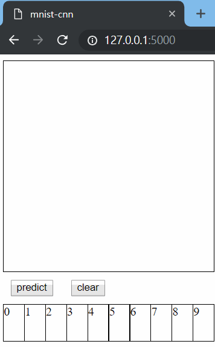

# mnist-cnn

just a keras mnist cnn example with some demo

---

demo.py (opencv-python)

---

server.py (flask)

---

## Develop enviroment
 - python 3.6

## dependency
 - keras 2.2.0 (assume tensorflow backend)
 - h5py 2.7.1
 - numpy 1.14.3
 - opencv-python 3.4.1.15 (demo.py only)
 - flask 1.0.2 (server.py only)
 
## contact
 - t105598018+wirl@ntut.org.tw
